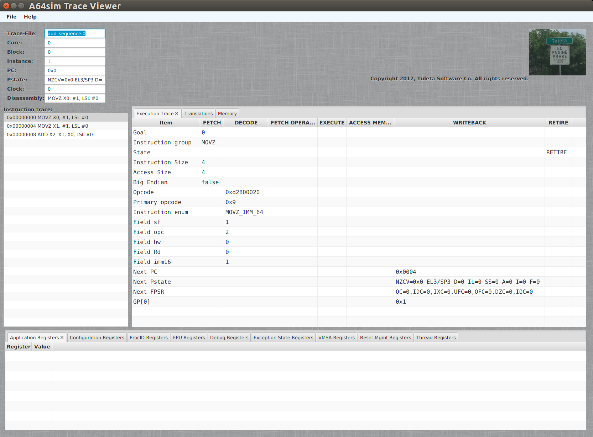

a64sim
======
:Author:    Tuleta Software Co.
:Email:     <gene@tuletasoftware.com>
:Date:      9/30/2019
:Revision:  alpha

Introduction
------------
*a64sim* is a stand-alone _arm64_ microprocessor software simulator. Using the *a64sim*
simulator, the user may simulate the execution of a single or multi-core _arm64_ processor with attached memory.
The input to *a64sim* consists of one or more _ELF_ object or _ELF_ binary files.
The output from *a64sim* may include an _ELF_ file and/or a _simulation trace_.

The _a64sim_ *simtrace-viewer* is a graphical viewer that may be used to load and study the _simulation trace_
produced by *a64sim*.

link:a64sim_license.adoc[License, Copyright Notice - Please read, thanks]

Requirements
------------
The *a64sim* simulator was compiled and linked using *gnu g++ version 8.3.0* and *Ubuntu Linux version 19.04*:

.Ubuntu version info
----
genec@genes-cube:~/Desktop/windvane/docs$ lsb_release -a
No LSB modules are available.
Distributor ID:	Ubuntu
Description:	Ubuntu 19.04
Release:	19.04
Codename:	disco
----

.*a64sim* Build Information
----
gene@gene-MS-7850:~/Desktop/windvane$ g++ --version
genec@genes-cube:~/Desktop/windvane/docs$ g++ --version
g++ (Ubuntu 8.3.0-6ubuntu1) 8.3.0
Copyright (C) 2018 Free Software Foundation, Inc.
This is free software; see the source for copying conditions.  There is NO
warranty; not even for MERCHANTABILITY or FITNESS FOR A PARTICULAR PURPOSE.
----

The *simtrace-viewer* was compiled using Java version 13 (Open source jdk-13, javafx-sdk-13):

.*simtrace-viewer* Build Information
----
genec@genes-cube:~/Desktop/windvane$ ../tools/jdk-13/bin/java --version
java 13 2019-09-17
Java(TM) SE Runtime Environment (build 13+33)
Java HotSpot(TM) 64-Bit Server VM (build 13+33, mixed mode, sharing)
----

Additionally, to assemble and/or compile the included examples, the _aarch64_ gnu bin tools were installed
(I used _sudo apt-get install gcc-aarch64-linux-gnu_ to get the precompiled gcc, etc)...

.*aarch* tools used
----
gene@gene-MS-7850:$ ls /usr/bin/*aarch*
/usr/bin/aarch64-linux-gnu-addr2line  /usr/bin/aarch64-linux-gnu-gcc-ar        /usr/bin/aarch64-linux-gnu-ld.bfd
/usr/bin/aarch64-linux-gnu-ar         /usr/bin/aarch64-linux-gnu-gcc-ar-5      /usr/bin/aarch64-linux-gnu-ld.gold
/usr/bin/aarch64-linux-gnu-as         /usr/bin/aarch64-linux-gnu-gcc-nm        /usr/bin/aarch64-linux-gnu-nm
/usr/bin/aarch64-linux-gnu-c++filt    /usr/bin/aarch64-linux-gnu-gcc-nm-5      /usr/bin/aarch64-linux-gnu-objcopy
/usr/bin/aarch64-linux-gnu-cpp        /usr/bin/aarch64-linux-gnu-gcc-ranlib    /usr/bin/aarch64-linux-gnu-objdump
/usr/bin/aarch64-linux-gnu-cpp-5      /usr/bin/aarch64-linux-gnu-gcc-ranlib-5  /usr/bin/aarch64-linux-gnu-ranlib
/usr/bin/aarch64-linux-gnu-dwp        /usr/bin/aarch64-linux-gnu-gcov          /usr/bin/aarch64-linux-gnu-readelf
/usr/bin/aarch64-linux-gnu-elfedit    /usr/bin/aarch64-linux-gnu-gcov-5        /usr/bin/aarch64-linux-gnu-size
/usr/bin/aarch64-linux-gnu-g++        /usr/bin/aarch64-linux-gnu-gcov-tool     /usr/bin/aarch64-linux-gnu-strings
/usr/bin/aarch64-linux-gnu-g++-5      /usr/bin/aarch64-linux-gnu-gcov-tool-5   /usr/bin/aarch64-linux-gnu-strip
/usr/bin/aarch64-linux-gnu-gcc        /usr/bin/aarch64-linux-gnu-gprof         /usr/bin/qemu-aarch64-static
/usr/bin/aarch64-linux-gnu-gcc-5      /usr/bin/aarch64-linux-gnu-ld

gene@gene-MS-7850$ /usr/bin/aarch64-linux-gnu-as --version
GNU assembler (GNU Binutils for Ubuntu) 2.26.1
Copyright (C) 2015 Free Software Foundation, Inc.
This program is free software; you may redistribute it under the terms of
the GNU General Public License version 3 or later.
This program has absolutely no warranty.
This assembler was configured for a target of `aarch64-linux-gnu'.
----

Quick start
-----------
*OOPS! THE EXAMPLES DIRECTORY HAS YET TO BE MOVED OVER FROM THE OLD REPOSITORY.*

Assuming you are in the _examples_ directory, _cd_ into the *example1* sub-directory.
This example consists of a three statement assembly language test (_add_sequence.s_) plus
a _makefile_ used to build and run the test. To assemble the test, run _make_:

.Example#1 Build
----
gene@gene-MS-7850:~examples/example1$ make
/usr/bin/aarch64-linux-gnu-as -g -a=add_sequence.lst add_sequence.s -o add_sequence.o
gene@gene-MS-7850:~examples/example1$ ls -l
total 20
-rw-rw-r-- 1 gene gene  680 Mar  4 07:54 add_sequence.lst
-rw-rw-r-- 1 gene gene 1896 Mar  4 07:54 add_sequence.o
-rw-rw-r-- 1 gene gene  132 Mar  4 06:56 add_sequence.s
drwxrwxr-x 2 gene gene 4096 Mar  4 07:17 artifacts
-rw-rw-r-- 1 gene gene  649 Mar  4 07:16 Makefile
----

Now run it...

.Example#1 Run
----
gene@gene-MS-7850:~examples/example1$ make test
/opt/a64sim/bin/a64sim -L add_sequence.o 
A64simulator/MP - Tuleta Software Co. Copyright 2017. All rights reserved.

  Setup appears valid.

Starting simulation...
Loading test from ELF file 'add_sequence.o'...
elf reader initialized...
Done.
For 1 cores:
   Total # of iterations 5
   Total # of instructions simulated: 4
Simulation ended.

Elapsed time: 0.654 ms.
simulation rate: 6116 instructions per second.
----

Cool, it works, but otherwise (since no output) not too interesting. Type _make test_ again,
but this time add -D (disassemble) to a64sim invocation:

.Example#1 Run, Show Progress
----
make test A64SIM_OPTIONS="-D"
/opt/a64sim/bin/a64sim -L add_sequence.o -D
A64simulator/MP - Tuleta Software Co. Copyright 2017. All rights reserved.

  Setup appears valid.

Starting simulation...
Loading test from ELF file 'add_sequence.o'...
elf reader initialized...
Done.
0x00000000  0xd2800020  MOVZ X0, #1, LSL #0
0x00000004  0xd2800021  MOVZ X1, #1, LSL #0
0x00000008  0x8b000022  ADD X2, X1, X0, LSL #0
For 1 cores:
   Total # of iterations 5
   Total # of instructions simulated: 4
Simulation ended.

Elapsed time: 0.244 ms.
simulation rate: 16393 instructions per second.
----

Now we see, for each ARM64 instruction executed, the address, opcode, and disassembly. You may have noticed that the assembly language test actually contained four instructions, the three instruction add sequence, followed by a _WFI_ instruction. When the _WFI_ instruction is decoded and recognized, the simulator halts the running core that the WFI instruction was to be executed on. For a single-core simulation this effectively ends the simulation.

So lets run this test yet again, this time adding command line options to output a _simulation trace_ file, and an _ELF_ file too...

.Example#1 Run, Show Progress, Dump _simulation trace_ and _ELF_
----
~/examples/example1$ make test A64SIM_OPTIONS="-D -S add_sequence.elf -T add_sequence"
/opt/a64sim/bin/a64sim -L add_sequence.o -P -S add_sequence.elf -T add_sequence
A64simulator/MP - Tuleta Software Co. Copyright 2017. All rights reserved.

  Setup appears valid.

Starting simulation...
Loading test from ELF file 'add_sequence.o'...
elf reader initialized...
Done.
0x00000000  0xd2800020  MOVZ X0, #1, LSL #0
0x00000004  0xd2800021  MOVZ X1, #1, LSL #0
0x00000008  0x8b000022  ADD X2, X1, X0, LSL #0
.  Sim-trace history file add_sequence.top created.
For 1 cores:
   Total # of iterations 5
   Total # of instructions simulated: 4
Simulation ended.

Saving test (elf64 format) image to file 'add_sequence.elf'...done.

Elapsed time: 0.779 ms.
simulation rate: 5134 instructions per second.

gene@gene-MS-7850:~/examples/example1$ ls
add_sequence.0  add_sequence.elf  add_sequence.lst  add_sequence.o  add_sequence.s  add_sequence.top  artifacts  Makefile
----

So now we have simulated the test, and have an _ELF_ output file, that we could use _objdump_ on and see the simulated instructions (is the WFI there?). We could also simulate again, this using the _ELF_ output file as the input file. You should see the same result. Try it.

[NOTE]
=========================================================================
By the way, for such a short test, the elapsed time and simulation rate
reported by the simulator can certainly be ignored. It probably takes
longer to load this particular test (and afterwards create the test
output) than it does to actually simulate it.
=========================================================================

We also have a _sim-trace_ (simulation trace) file that we can load up and view using the *simtrace-viewer* tool...

.Example#1 View test _simulation-trace_ output using the *simtrace-viewer*
----
tutorial/example1$ make viewtrace
sim-trace file: 'add_sequence.top'
core:           0
clock:          0
Loading from sim trace file: add_sequence.0
Done.
----

When the viewer loads, and after the *Tuleta Software* _splash screen_ goes away, the main window for the viewer is displayed:

In the upper left hand corner the trace-file, core#, instruction#, current PC, Pstate and clock are displayed. Below along the left side is the instruction trace that should be familiar. At startup (unless otherwise specified) the first instruction is selected. To the right of the instruction trace is the _Execution Trace_. The _Execution Trace_ displays decode, fetch, and execution details for the currently selected instruction, broken out by instruction phase.

The *a64sim* simulator (loosely) models a six stage execution pipeline. The stages are _FETCH_ (read instruction opcode from memory), _DECODE_ (decode the instruction opcode, control fields, register indices, and immediate values), _FETCH OPERANDS_ (read values for registers accessed, both general purpose and control registers), _EXECUTE_ (compute the outcome for an _Add_ instruction for instance), _ACCESS MEMORY_ (load or store values from main memory, and finally _WRITEBACK_ (write back register values). The _RETIRE_ stage isn't a real stage; an instruction is considered to execute to completion if its final stage is _RETIRED_. If an exception occurs during execution of an instruction, the instruction phase where the exception occurred will display the exception condition.

Notice that in addition to the _Execution Trace_ tab there is a _Translations_ tab, and a _Memory_ tab.
Select the _Translations_ tab to display any address translation associated with a particular instruction. There is always a translation associated with the instruction itself,i ie, the address for the instruction. If the instruction is a load or store there will be additional translations associated with the load or store. For each translation details concerning cacheing, memory type, sharability, and paging are displayed. If paging is enabled, then translations for descriptors will also be included.

Selecting the _Memory_ tab causes memory byte values to be displayed for any memory accessed by the instruction. Instruction memory and data memory, germaine to the selected instruction, is displayed. 

Across the bottom of the _simtrace-viewer_ are displayed current processor register values, grouped  by usage or feature. The _Application Register_ group includes general purpose registers*. The _Configuration Registers_ group includes *aarch64* registers that define what features are present in an implementation or give values for registers accessed at startup.
The other register groupings should be (mostly) self explanatory.

You may have also noted by this point that register values are not displayed until they are accessed or updated, and only after an instruction has _executed_. As an example when the first instruction in the add sequence is selected, the value for general purpose X0 is not displayed. Select the second instruction however and you see the the new value for X0 (the first instruction has been _retired_; its updates are now available). 

*NOTE: Curiously enough, as an artifact of the initial bring up of the simulator, the SCR_EL3 register is included in the _Configuration Registers_ group. 

Summary
-------
*a64sim* is a stand-alone _arm64_ microprocessor software simulator, that simulates the execution of a single or
multi-core _arm64_ processor with attached memory.
The _a64sim_ *simtrace-viewer* is a graphical viewer that may be used to load and study the _simulation trace_
produced by *a64sim*.

For more details on operating the *a64sim* simulator, and the implementation, see link:a64sim_users_guide.html[].

There are also more examples covering _MP_ (multi-processor) simulation, and developing stand-along C-based programs.
See the _examples_ sub-directory, within the tuleta_software release directory.

Cheers,

The staff of Tuleta Software.
